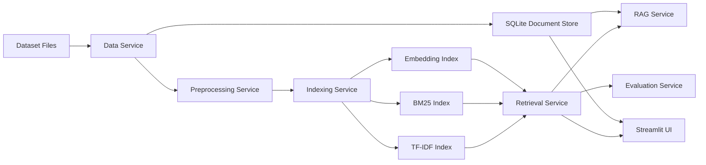

# Information Retrieval System

Python project for the 2026 Information Retrieval practical assignment.

## Dataset

The final implementation uses ClinicalTrials 2017 / TREC Precision Medicine 2017 data.

- Local documents: `241,006`
- Queries with qrels: `30`
- Dataset files:
  - downloaded through `ir_datasets`
  - dataset id: `clinicaltrials/2017/trec-pm-2017`

ClinicalTrials was selected because it is not Antique, contains more than 200K documents, provides qrels for formal evaluation, and can be processed as a complete dataset without taking only a sample.

## Features

- Data preprocessing service
- SQLite document store for original document retrieval
- TF-IDF retrieval
- BM25 retrieval with configurable `k1` and `b`
- Latent semantic embedding retrieval using TF-IDF + TruncatedSVD
- Query refinement with lightweight spelling correction and synonym expansion
- Session search history with similar-query suggestions
- History-based query expansion that adds related terms from past searches
- BERT/Sentence-BERT reranking after BM25 candidate retrieval
- Hybrid parallel retrieval with score fusion
- Hybrid serial retrieval with BM25 candidate generation and embedding reranking
- RAG-style chat interface with grounded source passages
- Evaluation with MAP, nDCG@10, Precision@10, and Recall
- Streamlit UI
- FastAPI REST gateway with OpenAPI documentation
- Independent service tests

## Architecture



## Run

Install dependencies:

```powershell
python -m pip install -r requirements.txt
```

This workspace already contains local dependencies in `.codex_deps`. To use them:

```powershell
$env:PYTHONPATH=".codex_deps;src"
```

Build the final index:

```powershell
python scripts\prepare.py --dataset clinicaltrials/2017/trec-pm-2017 --max-docs 0 --max-queries 0 --embedding-dims 64 --max-features 30000 --min-df 2 --max-df 0.95
```

Evaluate:

```powershell
python scripts\evaluate.py --dataset clinicaltrials/2017/trec-pm-2017 --max-queries 0
```

Search from CLI:

```powershell
python scripts\search.py "lung cancer EGFR adult" --method bm25 --top-k 10
```

Run UI:

```powershell
.\run_app.cmd
```

Run REST API:

```powershell
.\run_api.cmd
```

Open API documentation at `http://127.0.0.1:8000/docs`.

Run tests:

```powershell
.\run_tests.cmd
```

Optional BERT reranking:

```powershell
python -m pip install sentence-transformers
python scripts\search.py "what is diabetes treatment" --method bert_rerank --top-k 5
```

BERT reranking does not rebuild `search_index.joblib` or `documents.sqlite`. BM25 retrieves candidates first, then Sentence-BERT reranks only those candidates.

## Current Evaluation

The latest results are saved in `artifacts/evaluation_metrics.csv`, and the chart is saved in `reports/figures/evaluation_metrics.png`.

Latest full ClinicalTrials results:

| Method | MAP@1000 | nDCG@10 | Precision@10 | Recall@1000 |
|---|---:|---:|---:|---:|
| TF-IDF | 0.0912 | 0.1259 | 0.1621 | 0.5902 |
| BM25 | 0.1921 | 0.2892 | 0.3000 | 0.6787 |
| LSA Embedding | 0.0013 | 0.0045 | 0.0138 | 0.0763 |
| Hybrid Parallel | 0.1476 | 0.2292 | 0.2345 | 0.6086 |
| Hybrid Serial | 0.1770 | 0.2948 | 0.2862 | 0.6468 |

Best current baseline by MAP@1000: BM25.

Additional refined-query evaluation:

- `artifacts/evaluation_metrics_refined.csv`
- `reports/figures/evaluation_metrics_refined.png`

BERT and RAG evaluation:

- `artifacts/evaluation_metrics_bert.csv`
- `artifacts/rag_evaluation_metrics.csv`

## Final Arabic Report

- `reports/final/تقرير_مشروع_استرجاع_المعلومات_النهائي.pdf`
- `reports/final/تقرير_مشروع_استرجاع_المعلومات_النهائي.docx`

The report includes the dataset description, implementation stages, SOA architecture, service responsibilities, evaluation results, team task allocation, executable commands, screenshots, GitHub link, and references.

## Team

- الخضر الديواني
- نايا سعدون
- حلا العوض
- ليث ضاهر
- نوال صالح
